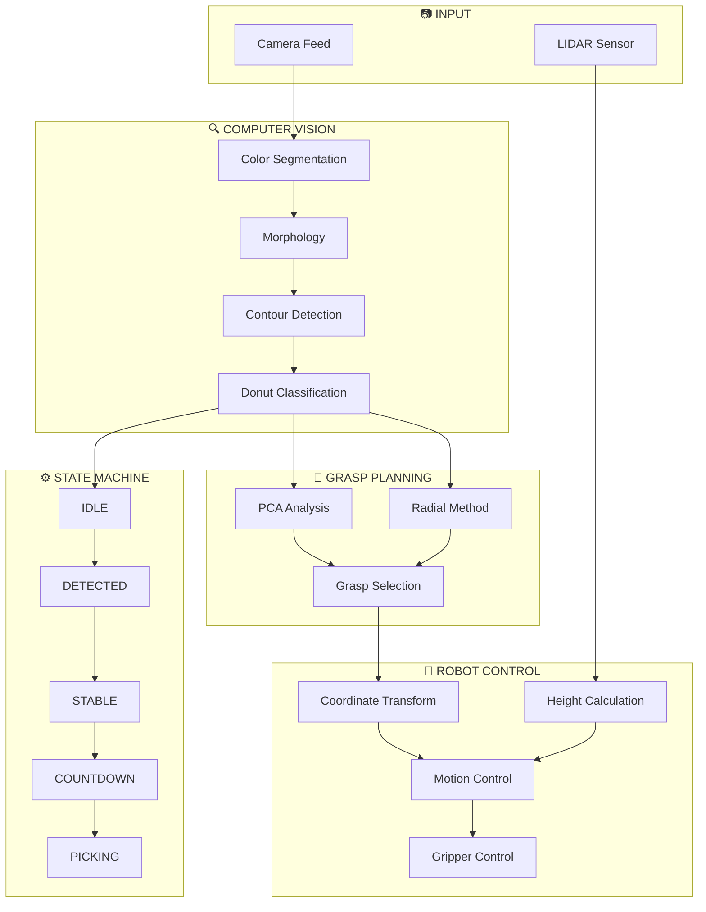

# 🤖 v15 Auto-Pick System - Overview

## 📌 ภาพรวมระบบทั้งหมด

ระบบหยิบวัตถุอัตโนมัติ (Autonomous Pick-and-Place) ที่รวม Computer Vision, LIDAR Sensing และ Robotic Control

---

## 📚 Workflow Documents

| # | Document | Description | Link |
|---|----------|-------------|------|
| 1 | **System Overview** | ภาพรวมทั้งหมด (นี่) | นี่ |
| 2 | **Hardware Architecture** | โครงสร้าง Hardware | `00-hardware-architecture.md` |
| 3 | **Data Flow** | การไหลของข้อมูล | `01-data-flow.md` |
| 4 | **Computer Vision Pipeline** | ขั้นตอน Image Processing | `02-computer-vision-pipeline.md` |
| 5 | **Grasp Planning** | การวางแผนการหยิบ | `03-grasp-planning.md` |
| 6 | **State Machine** | State Machine ของ Auto-Pick | `04-state-machine.md` |
| 7 | **Robot Control** | การควบคุมหุ่นยนต์ | `05-robot-control.md` |
| 8 | **Communication Protocol** | โปรโตคอลการสื่อสาร | `06-communication-protocol.md` |
| 9 | **Calibration** | การ Calibrate ระบบ | `07-calibration.md` |

---

## 🏗️ System Architecture

```
┌─────────────────────────────────────────────────────────────────────────────┐
│                           v15 AUTO-PICK SYSTEM                              │
├─────────────────────────────────────────────────────────────────────────────┤
│                                                                             │
│  ┌─────────────┐    ┌─────────────┐    ┌─────────────┐    ┌─────────────┐  │
│  │   SENSING   │    │  PROCESSING │    │  PLANNING   │    │  EXECUTION  │  │
│  ├─────────────┤    ├─────────────┤    ├─────────────┤    ├─────────────┤  │
│  │ • Camera    │───▶│ • Detection │───▶│ • Grasp     │───▶│ • Robot     │  │
│  │ • LIDAR     │    │ • Tracking  │    │   Selection │    │   Motion    │  │
│  │             │    │ • Height    │    │ • Path      │    │ • Gripper   │  │
│  └─────────────┘    └─────────────┘    └─────────────┘    └─────────────┘  │
│                                                                             │
└─────────────────────────────────────────────────────────────────────────────┘
```

---

## 🔄 Main Operation Flow



---

## 📊 Key Specifications

| Component | Specification |
|-----------|---------------|
| Robot | Dobot MG400 (4-axis) |
| Reach | 440mm |
| Payload | 750g |
| Camera | USB Webcam 640×480 |
| LIDAR | VL53L0X (0-2000mm) |
| Gripper | Servo-driven (0-54mm) |
| Cycle Time | ~30s per pick |

---

## ⏱️ Timing Parameters

| Phase | Duration |
|-------|----------|
| Object Detection | Real-time |
| Stability Check | 4.0 seconds |
| Countdown | 3.0 seconds |
| Pick Sequence | ~25 seconds |
| Cooldown | 3.0 seconds |
| **Total Cycle** | **~35 seconds** |

---

## 🎯 Supported Objects

| Type | Detection Method | Grasp Method |
|------|------------------|--------------|
| Solid Objects | HSV + Contour | PCA (minor axis) |
| Donut/Ring | Hole Ratio + Circularity | Radial (4 positions) |
| Dark Objects | Value threshold | Same as solid |

---

## 📁 Project Structure

```
this_one_is_main_v13/
├── 15_auto_pick_v15.ipynb      # 🎯 Main Application
├── 14.1_best_use_donut_grasp_v14_1.ipynb  # Previous version
├── homography_matrix.npy       # Calibration data
├── ...
│
.agent/workflows/
├── 00-system-overview.md       # This file
├── 00-hardware-architecture.md
├── 01-data-flow.md
├── 02-computer-vision-pipeline.md
├── 03-grasp-planning.md
├── 04-state-machine.md
├── 05-robot-control.md
├── 06-communication-protocol.md
└── 07-calibration.md
```

---

## 🚀 Quick Start

1. **Hardware Setup**: Connect Robot, Camera, ESP32
2. **Run Notebook**: Execute all cells in `15_auto_pick_v15.ipynb`
3. **Place Object**: Put object in workspace
4. **Wait**: 4s stable + 3s countdown
5. **Auto Pick**: Robot picks automatically

---

## 👥 System Modes

| Mode | Description | Toggle |
|------|-------------|--------|
| **AUTO** | ตรวจจับและหยิบอัตโนมัติ | Default |
| **MANUAL** | รอคำสั่งจากผู้ใช้ | Press `A` |
