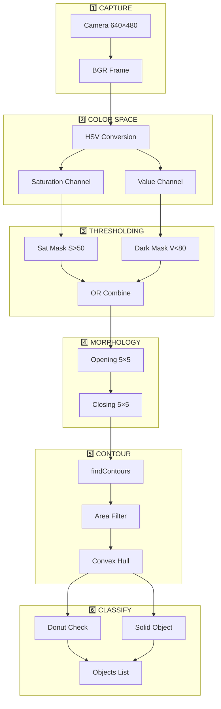

# 👁️ Computer Vision Pipeline

## 📌 Overview

ขั้นตอนการประมวลผลภาพตั้งแต่รับภาพจากกล้องจนถึงการตรวจจับวัตถุ

---

## 🔄 Pipeline Stages



---

## 1️⃣ Image Capture

```python
cap = cv2.VideoCapture(CAMERA_ID)  # CAMERA_ID = 2
ret, frame = cap.read()

# Output: frame.shape = (480, 640, 3)
# Output: frame.dtype = uint8
# Format: BGR (Blue, Green, Red)
```

### Sample Output
```
┌─────────────────────────────────┐
│         RAW BGR FRAME           │
│                                 │
│    ┌───────┐                    │
│    │ Object│  640 × 480         │
│    └───────┘  3 channels        │
│                                 │
└─────────────────────────────────┘
```

---

## 2️⃣ Color Space Conversion

```python
hsv = cv2.cvtColor(frame, cv2.COLOR_BGR2HSV)
h, s, v = cv2.split(hsv)

# H: Hue (0-179) - Color type
# S: Saturation (0-255) - Color intensity
# V: Value (0-255) - Brightness
```

### Why HSV?
| Channel | Purpose |
|---------|---------|
| **H** (Hue) | Detect specific colors |
| **S** (Saturation) | Detect colored vs gray objects |
| **V** (Value) | Detect dark objects |

---

## 3️⃣ Thresholding

### Saturation Mask (Colored Objects)
```python
_, sat_mask = cv2.threshold(s, 50, 255, cv2.THRESH_BINARY)

# If S > 50: pixel = 255 (white)
# If S <= 50: pixel = 0 (black)
```

### Dark Mask (Dark Objects)
```python
_, dark_mask = cv2.threshold(v, 80, 255, cv2.THRESH_BINARY_INV)

# If V < 80: pixel = 255 (white) - dark object
# If V >= 80: pixel = 0 (black) - bright area
```

### Combined Mask
```python
combined_mask = cv2.bitwise_or(sat_mask, dark_mask)

# Detects: colored objects OR dark objects
# Background (white/gray, unsaturated) = black
```

### Visual Example
```
 SAT_MASK          DARK_MASK         COMBINED
┌─────────┐       ┌─────────┐       ┌─────────┐
│  ░░░░░  │       │  ░░░░░  │       │  ░░░░░  │
│ ░████░  │  OR   │ ░░░░░░  │   =   │ ░████░  │
│ ░████░  │       │ ░███░░  │       │ ░████░  │
│  ░░░░░  │       │  ░░░░░  │       │  ░░░░░  │
└─────────┘       └─────────┘       └─────────┘
(colored obj)     (dark obj)        (all objects)
```

---

## 4️⃣ Morphological Operations

### Opening (Remove Noise)
```python
kernel = np.ones((5, 5), np.uint8)
mask = cv2.morphologyEx(combined_mask, cv2.MORPH_OPEN, kernel)

# Erosion → Dilation
# Removes small white spots (noise)
```

### Closing (Fill Holes)
```python
mask = cv2.morphologyEx(mask, cv2.MORPH_CLOSE, kernel)

# Dilation → Erosion
# Fills small black holes inside objects
```

### Visual Example
```
 BEFORE OPEN      AFTER OPEN       AFTER CLOSE
┌─────────┐       ┌─────────┐       ┌─────────┐
│ ░ ░ ░░░ │       │  ░░░░░  │       │  ░░░░░  │
│ ░██░██░ │  ───▶ │ ░████░  │  ───▶ │ ░████░  │
│ ░██ ██░ │       │ ░█░░█░  │       │ ░████░  │
│  ░░ ░░  │       │  ░░░░░  │       │  ░░░░░  │
└─────────┘       └─────────┘       └─────────┘
 (noisy)          (clean edges)     (filled)
```

---

## 5️⃣ Contour Detection

### Finding Contours
```python
contours, hierarchy = cv2.findContours(
    mask, 
    cv2.RETR_CCOMP,      # 2-level hierarchy (outer + inner)
    cv2.CHAIN_APPROX_SIMPLE
)
```

### Hierarchy Structure
```python
# hierarchy[i] = [next, previous, first_child, parent]

# RETR_CCOMP gives:
# - Outer contours (parent = -1)
# - Inner holes (parent = index of outer)
```

### Area Filtering
```python
MIN_OBJECT_AREA = 800   # Minimum pixels²
MAX_OBJECT_AREA = 50000 # Maximum pixels²

for i, cnt in enumerate(contours):
    if hierarchy[i][3] != -1:  # Skip inner contours
        continue
    
    area = cv2.contourArea(cnt)
    if not (MIN_OBJECT_AREA < area < MAX_OBJECT_AREA):
        continue
    
    # Process valid object...
```

### Convex Hull
```python
hull = cv2.convexHull(cnt)

# Simplifies contour to convex shape
# Removes concave details
```

```
   ORIGINAL           CONVEX HULL
  ┌─────────┐        ┌─────────┐
  │  ╭──╮   │        │  ╭───╮  │
  │ ╭╯  ╰╮  │   ───▶ │ ╭╯   ╰╮ │
  │╭╯    ╰╮ │        │╭╯     ╰╮│
  │ ╰────╯  │        │ ╰─────╯ │
  └─────────┘        └─────────┘
   (irregular)        (smooth)
```

---

## 6️⃣ Object Classification

### Donut Detection
```python
# Find inner holes
hole_area = 0
hole_contour = None
child_idx = hierarchy[i][2]

while child_idx != -1:
    child_area = cv2.contourArea(contours[child_idx])
    if child_area > hole_area:
        hole_area = child_area
        hole_contour = contours[child_idx]
    child_idx = hierarchy[child_idx][0]

# Calculate ratios
hole_ratio = hole_area / area

# Circularity
perimeter = cv2.arcLength(cnt, True)
circularity = 4 * np.pi * area / (perimeter ** 2)

# Classification
is_donut = (
    DONUT_HOLE_RATIO_MIN <= hole_ratio <= DONUT_HOLE_RATIO_MAX and
    circularity >= DONUT_CIRCULARITY_MIN
)
# DONUT_HOLE_RATIO_MIN = 0.1
# DONUT_HOLE_RATIO_MAX = 0.7
# DONUT_CIRCULARITY_MIN = 0.5
```

### Classification Chart
```
           Hole Ratio
         0    0.1    0.7    1.0
         ├─────┼──────┼──────┤
         │     │ DONUT│      │
Circ ≥0.5│ SOLID    area   TOO  │
         │     │      │ HOLLOW │
         ├─────┴──────┴──────┤
Circ <0.5│   SOLID (irregular)  │
         └────────────────────┘
```

---

## 📊 Performance Metrics

| Stage | Time (approx) |
|-------|---------------|
| Capture | 5-10 ms |
| HSV Convert | 1-2 ms |
| Thresholding | 1-2 ms |
| Morphology | 2-3 ms |
| Contours | 3-5 ms |
| Classification | 1-2 ms |
| **Total** | **~15-25 ms** |

---

## 🔧 Tunable Parameters

| Parameter | Default | Effect |
|-----------|---------|--------|
| `S_THRESHOLD` | 50 | Higher = less sensitive to pale colors |
| `V_THRESHOLD` | 80 | Lower = detect darker objects |
| `KERNEL_SIZE` | 5×5 | Larger = smoother edges |
| `MIN_OBJECT_AREA` | 800 | Higher = ignore small objects |
| `MAX_OBJECT_AREA` | 50000 | Lower = ignore large objects |
| `DONUT_HOLE_RATIO_MIN` | 0.1 | Minimum hole size to be donut |
| `DONUT_HOLE_RATIO_MAX` | 0.7 | Maximum hole size (else too hollow) |
| `DONUT_CIRCULARITY_MIN` | 0.5 | Minimum roundness for donut |
