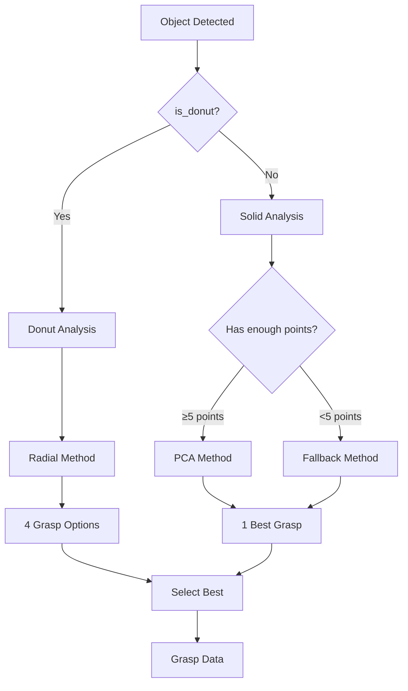

# 🎯 Grasp Planning

## 📌 Overview

การวิเคราะห์และเลือกจุดหยิบที่เหมาะสมสำหรับวัตถุแต่ละประเภท

---

## 🔀 Decision Flow



---

## 📐 Method 1: PCA Analysis (Solid Objects)

### Principle
ใช้ Principal Component Analysis หาแกนหลักของวัตถุ แล้วจับขวางแกนรอง (ด้านแคบที่สุด)

### Algorithm
```python
def _analyze_solid(self, obj):
    cnt = obj.get('contour')
    
    # 1. Get contour points
    pts = cnt.reshape(-1, 2).astype(np.float64)
    
    # 2. Calculate centroid
    mean = np.mean(pts, axis=0)
    pts_centered = pts - mean
    
    # 3. Covariance matrix
    cov = np.cov(pts_centered.T)
    
    # 4. Eigenvalue decomposition
    eigenvalues, eigenvectors = np.linalg.eig(cov)
    
    # 5. Sort by eigenvalue (largest first)
    idx = np.argsort(eigenvalues)[::-1]
    eigenvectors = eigenvectors[:, idx]
    
    # 6. Extract axes
    major = eigenvectors[:, 0]  # Long axis
    minor = eigenvectors[:, 1]  # Short axis
    
    # 7. Calculate grasp angle (perpendicular to major axis)
    angle = np.degrees(np.arctan2(major[1], major[0]))
    grasp_angle = normalize(angle + 90)
    
    # 8. Calculate grip width (projection on minor axis)
    proj = np.dot(pts_centered, minor)
    width_mm = (np.max(proj) - np.min(proj)) / PIXELS_PER_MM
```

### Visual Explanation
```
                    Major Axis (eigenvector 1)
                         ↗
            ┌───────────────────────┐
            │                       │
            │     ╔═══════════╗     │ ← Minor Axis (eigenvector 2)
            │     ║  OBJECT   ║     │   (Grasp direction)
            │     ╚═══════════╝     │
            │           ↑           │
            │      Width (narrow)   │
            └───────────────────────┘
                       
            Gripper grabs along MINOR axis
            (narrowest dimension)
```

### Mathematical Details
```
Covariance Matrix:
    ┌         ┐
    │ Var(X)  Cov(X,Y) │
C = │                   │
    │ Cov(X,Y)  Var(Y) │
    └         ┘

Eigenvalue λ₁ > λ₂
Eigenvector v₁ = Major axis (longest spread)
Eigenvector v₂ = Minor axis (shortest spread)

Grasp angle = atan2(v₁.y, v₁.x) + 90°
Grip width = max(pts·v₂) - min(pts·v₂)
```

---

## 🍩 Method 2: Radial Method (Donut Objects)

### Principle
สำหรับวัตถุรูปโดนัท ต้องจับที่ขอบ (ring) โดยเปิด Gripper ให้พอดีความหนาของขอบ

### Algorithm
```python
def _analyze_donut(self, obj):
    outer = obj.get('outer_contour')
    hole = obj.get('hole_contour')
    
    # 1. Calculate centers
    M_outer = cv2.moments(outer)
    cx_outer = int(M_outer['m10'] / M_outer['m00'])
    cy_outer = int(M_outer['m01'] / M_outer['m00'])
    
    # 2. Calculate radii
    outer_rect = cv2.minAreaRect(outer)
    hole_rect = cv2.minAreaRect(hole)
    outer_radius = min(outer_rect[1]) / 2
    hole_radius = min(hole_rect[1]) / 2
    
    # 3. Ring thickness
    ring_thickness_px = outer_radius - hole_radius
    ring_thickness_mm = ring_thickness_px / PIXELS_PER_MM
    
    # 4. Generate 4 grasp positions
    grasp_radius = (outer_radius + hole_radius) / 2
    
    for angle_deg in [0, 90, 180, 270]:
        angle_rad = np.radians(angle_deg)
        
        # Grasp point on ring center
        gx = cx_outer + grasp_radius * np.cos(angle_rad)
        gy = cy_outer + grasp_radius * np.sin(angle_rad)
        
        # Grasp angle = radial direction
        grasp_angle = normalize(angle_deg)
```

### Visual Explanation
```
              270° (Top)
                 │
                 ▼
         ┌───────────────┐
        ╱   ╭─────────╮   ╲
       │   ╱           ╲   │
 180° ─│──│  ╭───────╮  │──│─ 0° (Right)
(Left) │   ╲   (hole) ╱   │
        ╲   ╰─────────╯   ╱
         └───────────────┘
                 ▲
                 │
              90° (Bottom)

    Ring Thickness = Outer Radius - Hole Radius
    
    Grasp positions at 0°, 90°, 180°, 270°
    Gripper opens RADIALLY (pointing at center)
```

### Grasp Positions Detail
```
Position: RIGHT (0°)
          ┌───────────┐
          │     ═══   │ ← Gripper
          │    ╭───╮──│── opens horizontally
          │    │ ○ │  │
          │    ╰───╯  │
          └───────────┘

Position: BOTTOM (90°)
          ┌───────────┐
          │    ╭───╮  │
          │    │ ○ │  │
          │    ╰─║─╯  │ ← Gripper
          │      ║    │   opens vertically
          └───────────┘
```

### LIDAR Point Offset
```python
# LIDAR measures slightly toward outer edge
lidar_offset = ring_thickness_px * 0.3
lx = cx + (grasp_radius + lidar_offset) * cos(angle)
ly = cy + (grasp_radius + lidar_offset) * sin(angle)
```

---

## 📦 Method 3: Fallback (MinAreaRect)

### When Used
- Contour has < 5 points (PCA requires ≥ 5)
- PCA fails or gives invalid result

### Algorithm
```python
def _fallback(self, obj):
    rect = obj.get('rect')
    (cx, cy), (w, h), angle = rect
    
    # Grip along shorter dimension
    grip_w = min(w, h) / PIXELS_PER_MM
    grip_a = angle + 90 if w < h else angle
    
    return [{
        'center': (cx, cy),
        'width_mm': grip_w,
        'camera_angle': normalize(grip_a),
        'type': 'Rect-Fallback'
    }]
```

### Visual
```
          angle
            ↗
    ┌──────────────┐
    │              │ h
    │   ┌──────┐   │
    │   │ RECT │   │
    │   └──────┘   │
    │      w       │
    └──────────────┘
    
    If w < h: grip along w-axis (angle + 90°)
    If w ≥ h: grip along h-axis (angle)
```

---

## 🔢 Angle Normalization

```python
def _normalize(self, a):
    while a > 90: a -= 180
    while a < -90: a += 180
    return a

# Examples:
# 100° → -80°
# -100° → 80°
# 45° → 45°
# 180° → 0°
```

### Why Normalize?
```
Gripper is symmetric, so:
  0° and 180° are equivalent
 45° and -135° are equivalent

Valid range: -90° to +90°
```

---

## 📊 Grasp Data Output

```python
grasp = {
    'center': (gx, gy),           # Grasp point (pixels)
    'lidar_point': (lx, ly),      # LIDAR point (pixels)
    'width_mm': 25.4,             # Grip width (mm)
    'camera_angle': 45.0,         # Angle in camera frame (deg)
    'score': 1.0,                 # Confidence 0-1
    'type': 'PCA-Solid',          # Method used
    'position': 'Right',          # Only for donut
    'is_donut_grasp': False       # Special handling flag
}
```

---

## 🎚️ Gripper Pre-opening Strategy

### Solid Objects
```python
# Open to maximum, then close to grip
gripper.open_for_object(GRIPPER_MAX_WIDTH_MM)  # 54mm
# After descending:
gripper.grip_object(width - 8.5)  # Squeeze margin
```

### Donut Objects
```python
# Pre-open to ring thickness + margin
pre_open_width = ring_thickness + 15 + 5  # Extra margin
gripper.open_to_width(pre_open_width)
# Fingers slide onto ring edge before closing
```

### Why Different?
```
SOLID: Large opening to avoid collision
       ═══════════════
          │ OBJ │
       ═══════════════
       
DONUT: Precise opening to fit ring
       ═══   ═══
        ╲ ┌─┐ ╱
         ╲│ │╱
          ╲─╱ ← Ring edge slots between fingers
```

---

## 📈 Grasp Quality Scoring

| Factor | Weight | Description |
|--------|--------|-------------|
| Position | 0.1 | 0°>90°>180°>270° for donut |
| Width | - | Must be < GRIPPER_MAX (54mm) |
| Method | Implicit | PCA > Fallback |

```python
# Donut scoring
for i, angle in enumerate([0, 90, 180, 270]):
    score = 1.0 - i * 0.1  # [1.0, 0.9, 0.8, 0.7]
    
# Solid scoring
score = 1.0  # PCA method
score = 0.6  # Fallback method
```
