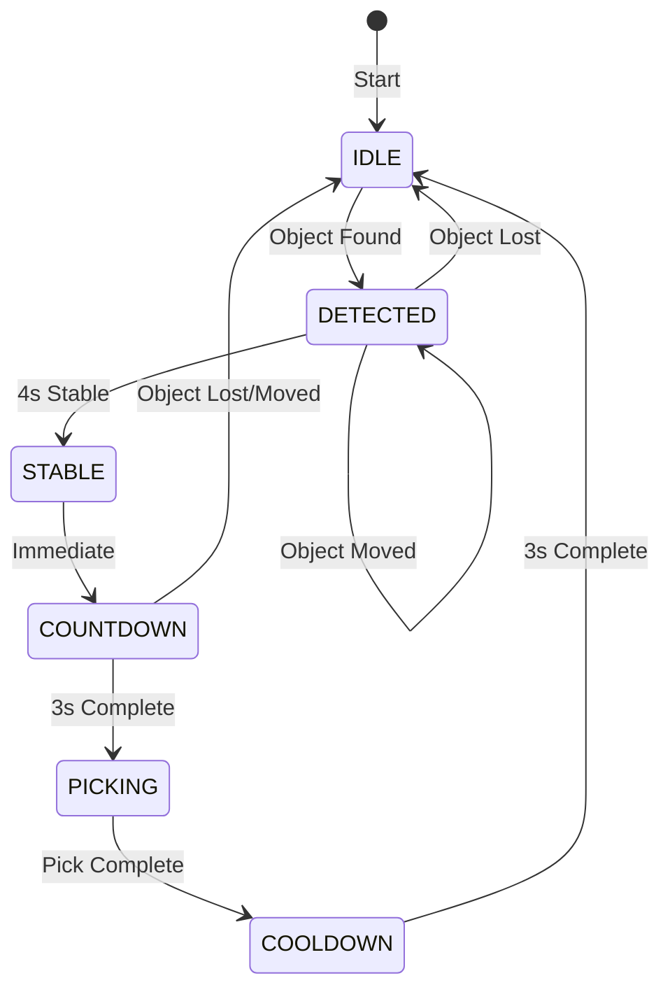

# ⚙️ State Machine

## 📌 Overview

State Machine สำหรับควบคุมการทำงาน Auto-Pick อัตโนมัติ

---

## 🔄 State Diagram



---

## 📋 State Descriptions

| State | Duration | Entry Condition | Exit Condition |
|-------|----------|-----------------|----------------|
| **IDLE** | - | Initial / Reset | Object detected |
| **DETECTED** | 0-4s | Object found | 4s stable / Object lost |
| **STABLE** | instant | 4s stable | Immediate → Countdown |
| **COUNTDOWN** | 0-3s | After stable | 3s / Object lost |
| **PICKING** | ~30s | Countdown done | Pick complete |
| **COOLDOWN** | 0-3s | After picking | 3s timeout |

---

## 🎨 Visual Feedback

### State Colors (BGR)
```python
STATE_COLORS = {
    IDLE:      (100, 100, 100),  # Gray
    DETECTED:  (0, 200, 255),    # Orange (waiting)
    STABLE:    (255, 200, 0),    # Cyan
    COUNTDOWN: (0, 128, 255),    # Orange-Red
    PICKING:   (0, 0, 255),      # Red (active)
    COOLDOWN:  (128, 128, 128),  # Gray
}
```

### State Messages
```python
STATE_MESSAGES = {
    IDLE:      "🔍 Scanning...",
    DETECTED:  "👀 Detected!",
    STABLE:    "✋ Hold still...",
    COUNTDOWN: "⏱️ Countdown",
    PICKING:   "🤖 Picking...",
    COOLDOWN:  "⏸️ Cooldown",
}
```

---

## 🔍 State: IDLE

### Behavior
```python
# Wait for object to appear
target = find_closest_to_center(objects, frame_center)

if target is not None:
    state = DETECTED
    tracked_center = target['center']
    tracked_area = target['area']
    detect_time = now
```

### Display
```
┌────────────────────────────────────────────┐
│  v15 AUTO  |  🔍 Scanning...              │  ← Gray header
├────────────────────────────────────────────┤
│                                            │
│      (No object highlighting)              │
│                                            │
└────────────────────────────────────────────┘
```

---

## 👀 State: DETECTED

### Behavior
```python
# Check if same object (stability)
if not is_same_object(target):
    # Reset timer if moved
    detect_time = now
    tracked_center = target['center']
    return

# Check if stable enough
elapsed = now - detect_time
if elapsed >= AUTO_STABLE_TIME_SEC:  # 4 seconds
    state = STABLE
```

### Stability Check
```python
def is_same_object(self, obj):
    dx = abs(obj['center'][0] - self.tracked_center[0])
    dy = abs(obj['center'][1] - self.tracked_center[1])
    area_diff = abs(obj['area'] - self.tracked_area) / self.tracked_area
    
    return (dx < 20 and dy < 20 and area_diff < 0.15)
    #      ↑ pixels      ↑ pixels      ↑ 15%
```

### Display
```
┌────────────────────────────────────────────┐
│  v15 AUTO  |  👀 Detected!  75%           │  ← Orange header
├────────────────────────────────────────────┤
│                                            │
│           ╭─────────────╮                  │
│          ╱               ╲   Progress      │
│         │   ┌───────┐    │   Ring          │
│         │   │ OBJECT│    │   (75% full)    │
│         │   └───────┘    │                 │
│          ╲      ↑       ╱                  │
│           ╰─────────────╯                  │
│                                            │
└────────────────────────────────────────────┘
```

---

## ⏱️ State: COUNTDOWN

### Behavior
```python
remaining = AUTO_COUNTDOWN_SEC - (now - countdown_time)

if remaining <= 0:
    state = PICKING
    return "PICK"  # Trigger pick action
```

### Display
```
┌────────────────────────────────────────────┐
│  v15 AUTO  |  ⏱️ Countdown  2.3s          │  ← Orange-Red header
├────────────────────────────────────────────┤
│                                            │
│           ╭═════════════╮                  │
│          ╱═══════════════╲   Countdown     │
│         │   ┌───────┐    │   Ring          │
│         │   │ 2.3s  │    ║   (filling)     │
│         │   └───────┘    │                 │
│          ╲              ╱                  │
│           ╰─────────────╯                  │
│                                            │
└────────────────────────────────────────────┘
```

---

## 🤖 State: PICKING

### Behavior
```python
# Execute pick sequence
# (Robot movement, LIDAR, gripper control)

# When complete:
state = COOLDOWN
cooldown_time = now
```

### Display
```
┌────────────────────────────────────────────┐
│  v15 AUTO  |  🤖 Picking...               │  ← Red header
├────────────────────────────────────────────┤
│                                            │
│        Robot is executing pick             │
│        Camera may lose object              │
│                                            │
└────────────────────────────────────────────┘
```

---

## ⏸️ State: COOLDOWN

### Behavior
```python
# Prevent immediate re-detection
elapsed = now - cooldown_time

if elapsed >= AUTO_COOLDOWN_SEC:  # 3 seconds
    reset()  # Back to IDLE
```

### Purpose
```
Why Cooldown?

1. Hand Avoidance
   ─────────────
   User's hand may still be in frame after placing object.
   Cooldown prevents grabbing the hand.

2. Settle Time
   ───────────
   Let robot return to home position before next detection.

3. Prevent Double-Pick
   ───────────────────
   If object drops, don't immediately try again.
```

---

## 📊 Timing Diagram

```
Time →  0s     4s      7s           ~37s          40s
        │      │       │              │             │
IDLE    ████───┤       │              │             │
              │       │              │             │
DETECTED      │──────▶│              │             │
              │ 4sec  │              │             │
STABLE        │       ├──┤           │             │
              │       │  │instant    │             │
COUNTDOWN     │       │  │──────────▶│             │
              │       │     3sec     │             │
PICKING       │       │              ├────────────▶│
              │       │              │    ~30sec   │
COOLDOWN      │       │              │             ├──────▶
              │       │              │             │  3sec
              │       │              │             │
              │       │              │             │
              ▼       ▼              ▼             ▼
          [Object  [Stable]    [Pick Start]   [Back to
           Found]                               IDLE]
```

---

## 🔀 Transition Table

| From State | Event | To State | Action |
|------------|-------|----------|--------|
| IDLE | Object found | DETECTED | Start tracking |
| DETECTED | Object lost | IDLE | Reset |
| DETECTED | Object moved | DETECTED | Reset timer |
| DETECTED | 4s elapsed | STABLE | - |
| STABLE | (immediate) | COUNTDOWN | Start countdown |
| COUNTDOWN | Object lost | IDLE | Reset |
| COUNTDOWN | Object moved | IDLE | Reset |
| COUNTDOWN | 3s elapsed | PICKING | Execute pick |
| PICKING | Pick done | COOLDOWN | Start cooling |
| COOLDOWN | 3s elapsed | IDLE | Reset |

---

## 📝 Class Implementation

```python
class AutoPickStateMachine:
    def __init__(self):
        self.state = AutoState.IDLE
        self.tracked_center = None
        self.tracked_area = None
        self.tracked_object = None
        self.selected_grasp = None
        self.detect_time = None
        self.stable_time = None
        self.countdown_time = None
        self.cooldown_time = None
    
    def update(self, objects, grasp_selector, frame_center):
        """Called every frame, returns action or None"""
        ...
    
    def reset(self):
        """Reset to IDLE state"""
        ...
    
    def is_same_object(self, obj):
        """Check if object is same as tracked"""
        ...
    
    def get_countdown_remaining(self):
        """Get remaining countdown seconds"""
        ...
    
    def get_stable_progress(self):
        """Get stability progress 0.0-1.0"""
        ...
    
    def start_cooldown(self):
        """Enter cooldown state after pick"""
        ...
```

---

## ⚙️ Configuration Parameters

```python
AUTO_STABLE_TIME_SEC = 4.0      # Time to confirm stable
AUTO_COUNTDOWN_SEC = 3.0        # Countdown before pick
AUTO_POSITION_TOLERANCE = 20    # Pixels movement allowed
AUTO_AREA_TOLERANCE = 0.15      # 15% area change allowed
AUTO_COOLDOWN_SEC = 3.0         # Cooldown after pick
```
