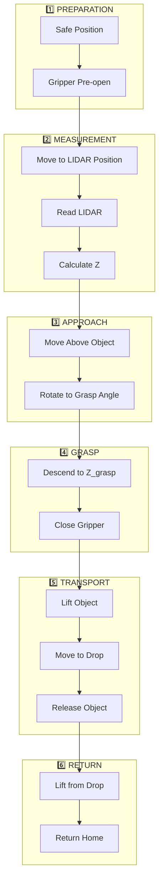

# 🤖 Robot Control

## 📌 Overview

การควบคุม Dobot MG400 และ Gripper ในขั้นตอนการหยิบวัตถุ

---

## 🔄 Pick Sequence



---

## 1️⃣ Phase 1: Preparation

### Safe Position
```python
robot.joint_move_and_wait(0, 0, 0, 0, 1)

# Joint angles: J1=0°, J2=0°, J3=0°, J4=0°
# Robot at neutral/safe position
```

```
         J2
        ╱───╮
    J1 │    │J3
   ────┴────┴───▶ Arm extended straight
       Base      J4
```

### Gripper Pre-open
```python
if is_donut:
    # Open to ring thickness + margins
    pre_open_width = grip_w + GRIPPER_OPEN_MARGIN_MM + 15
    gripper.open_to_width(pre_open_width)
else:
    # Open fully for solid objects
    gripper.open_for_object(GRIPPER_MAX_WIDTH_MM)  # 54mm
```

---

## 2️⃣ Phase 2: Height Measurement

### Move to LIDAR Position
```python
# Apply LIDAR offset
lidar_x = lidar_point_x + LIDAR_X_OFFSET  # +25.08mm
lidar_y = lidar_point_y + LIDAR_Y_OFFSET  # +20.71mm

robot.move_to_and_wait(lidar_x, lidar_y, Z_MEASURE, robot_r, 2)
# Z_MEASURE = 120mm (above workspace)
```

### Read LIDAR
```python
lidar_dist = gripper.read_lidar(samples=100)

# 100 samples → median for accuracy
# Returns distance in mm (e.g., 185mm)
```

### Calculate Z_grasp
```python
# Base Z from LIDAR reading
z_base = Z_MEASURE - lidar_dist + LIDAR_PHYSICAL_OFFSET + LIDAR_CORRECTION
#      = 120      - 185        + 60                    + (-21)
#      = -26mm

# Estimated object height
est_h = max(0, Z_FLOOR - z_base + (Z_MEASURE - Z_FLOOR))
#     = max(0, -64 - (-26) + (120 - (-64)))
#     = max(0, -38 + 184) = 146mm

# Apply height correction
z_grasp = z_base - est_h * HEIGHT_CORRECTION_FACTOR
#       = -26 - 146 * 0.115
#       = -26 - 16.79 = -42.79mm

# Clamp to floor
z_grasp = max(Z_FLOOR, z_grasp)  # max(-64, -42.79) = -42.79mm
```

### Z Calculation Diagram
```
    Z=120 (Z_MEASURE) ─────────────────────── LIDAR Position
         │                                    
         │   ↕ lidar_dist (185mm)
         │
    Z=? ──────────────────────────────────── Object Top
         │   ↕ object height (est_h)
         │
    Z=-64 (Z_FLOOR) ──────────────────────── Ground Level
```

---

## 3️⃣ Phase 3: Approach

### Move Above Object
```python
robot.move_to_and_wait(gripper_x, gripper_y, Z_MEASURE, robot_r, 2)

# Stay at Z_MEASURE (120mm) initially
# robot_r = ROBOT_R_OFFSET = -25.55° (default)
```

### Rotate to Grasp Angle
```python
final_r = robot.camera_angle_to_robot_r(camera_angle)
#       = ROBOT_R_OFFSET - camera_angle
#       = -25.55 - 45 = -70.55° (example)

robot.move_to_and_wait(gripper_x, gripper_y, Z_MEASURE, final_r, 2)
```

### Angle Conversion
```
Camera Frame:           Robot Frame:
    ↑ 0°                    ↓ 0°
    │                       │
←───┼───→               ←───┼───→
    │                       │
    ↓ 180°                  ↑ 180°

robot_r = R_OFFSET - camera_angle
(Accounts for camera mounting orientation)
```

---

## 4️⃣ Phase 4: Grasp

### Descend to Object
```python
robot.move_to_and_wait(gripper_x, gripper_y, z_grasp, final_r, 2)

# Gripper descends with fingers pre-opened
```

### Close Gripper
```python
gripper.grip_object(grip_w - 8.5)

# Squeeze margin of 8.5mm
# Ensures firm grip
time.sleep(4)  # Wait for grip to settle
```

```
  Before Grip        After Grip
  ═══      ═══      ═══════════
    ╲      ╱            ╲  ╱
     ╲    ╱              ╲╱
    ┌────┐            ┌────┐
    │OBJ │            │OBJ │
    └────┘            └────┘
```

---

## 5️⃣ Phase 5: Transport

### Lift Object
```python
robot.move_to_and_wait(gripper_x, gripper_y, z_grasp + 50, final_r, 2)

# Lift 50mm above grasp position
```

### Move to Drop Zone
```python
DROP_POS = (169.71, 58.01, -17.07, 13.78)

robot.move_to_and_wait(*DROP_POS[:3], DROP_POS[3], 3)
# X=169.71, Y=58.01, Z=-17.07, R=13.78°
```

### Release Object
```python
gripper.release()
time.sleep(2)

# Opens gripper to target_width + 10mm
```

---

## 6️⃣ Phase 6: Return Home

### Lift from Drop Zone
```python
robot.move_to_and_wait(DROP_POS[0], DROP_POS[1], 150, DROP_POS[3], 2)

# Raise to Z=150mm before moving
```

### Return to Home
```python
robot.joint_move_and_wait(0, 0, 0, 0, 3)  # Joints to neutral
robot.home()  # Final home position

# HOME = MovJ(-253.07, 115.17, -17.07, -62.78)
```

---

## ⏱️ Timing Breakdown

| Phase | Steps | Duration |
|-------|-------|----------|
| Preparation | Safe + Gripper | ~3s |
| Measurement | Move + LIDAR | ~6s |
| Approach | Above + Rotate | ~4s |
| Grasp | Descend + Grip | ~6s |
| Transport | Lift + Drop | ~5s |
| Return | Lift + Home | ~8s |
| **Total** | | **~32s** |

---

## 📐 Coordinate Transformation

### Pixel to Robot
```python
def pixel_to_robot(self, u, v):
    pt = np.array([u, v, 1], dtype=np.float32)
    res = np.dot(self.H, pt)  # Homography multiplication
    return res[0]/res[2], res[1]/res[2]
```

### Homography Matrix
```
        ┌                          ┐
    H = │ h11  h12  h13 │   3×3 Matrix
        │ h21  h22  h23 │   from calibration
        │ h31  h32  h33 │
        └                          ┘

    ┌   ┐       ┌   ┐
    │ x'│       │ u │
    │ y'│ = H × │ v │
    │ w'│       │ 1 │
    └   ┘       └   ┘

    robot_x = x'/w'
    robot_y = y'/w'
```

---

## 🦾 Gripper Commands

### Width to Angle Conversion
```python
def mm_to_angle(self, width_mm):
    CALIB_WIDTHS = [54, 52, 48, 40, 32, 23, 12, 3, 0]
    CALIB_ANGLES = [22, 30, 40, 50, 60, 70, 80, 90, 96]
    
    width = max(0.0, min(54.0, width_mm))
    return np.interp(width, CALIB_WIDTHS[::-1], CALIB_ANGLES[::-1])
```

### Command Protocol
```python
# Open to specific width
gripper.send_command(f'G{angle}')

# Serial format: "G45\n"
# ESP32 sets servo to 45°
```

---

## ⚠️ Error Handling

### LIDAR Failure
```python
lidar_dist = gripper.read_lidar(samples=100)
if lidar_dist is None:
    print("❌ LIDAR failed!")
    robot.home()
    return False  # Abort pick
```

### Out of Bounds
```python
z_grasp = max(Z_FLOOR, z_grasp)  # Never go below floor

# Homography should keep X,Y in workspace
# Robot will error if out of reach
```

---

## 🔧 Key Parameters

| Parameter | Value | Description |
|-----------|-------|-------------|
| `Z_MEASURE` | 120mm | Height for LIDAR reading |
| `Z_FLOOR` | -64mm | Ground level |
| `LIDAR_PHYSICAL_OFFSET` | 60mm | LIDAR mounting offset |
| `LIDAR_CORRECTION` | -21mm | Calibration correction |
| `LIDAR_X_OFFSET` | 25.08mm | X offset from gripper |
| `LIDAR_Y_OFFSET` | 20.71mm | Y offset from gripper |
| `HEIGHT_CORRECTION_FACTOR` | 0.115 | Grasp depth factor |
| `ROBOT_R_OFFSET` | -25.55° | Angle offset |
