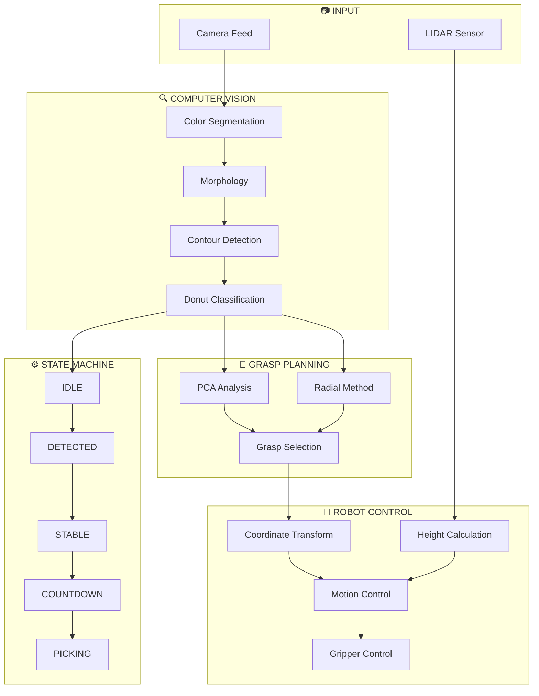

**🤖 PCA-based Artificial monograsp system for DOBOT MG400 (V15)**

Automated Object Grasping with LIDAR + Camera + Dobot MG400
[](https://github.com/newton1306/PCA-based-Artificial-monograsp-system-for-DOBOT-MG400/tree/main/)


## ✨ Overview

A precision grasp detection system for the Dobot MG400 robot that uses **LIDAR** for accurate height measurement and **Camera** for position detection, enabling reliable object grasping even with challenging geometries.



### 🎯 Key Capabilities

- ✅ **Universal Grasping** - Handles both **solid objects** and **donut-shaped objects** (with holes)
- ✅ **Intelligent Grasp Selection** - Uses PCA-based algorithm to determine optimal grip points
- ✅ **No YOLO Required** - Fast Color + Edge Detection approach
- ✅ **LIDAR Height Measurement** - More accurate than depth cameras
- ✅ **Height-based Correction** - Adaptive Z-axis adjustment
- ✅ **Self-contained** - Everything in a single notebook

---
Note: The execution speed in this demo is intentionally slowed down for testing and safety validation. It is not a limitation of the algorithm or the hardware.
https://github.com/user-attachments/assets/179da8aa-e3a6-4142-b3bb-b2f6fadb9ea3

## 🔍 Grasp Intelligence

The system intelligently analyzes object geometry to determine the best grasp strategy:

### Strategy 1: Solid Objects (PCA Method)

```
      Before PCA Analysis              After PCA Analysis              Gripper Approach
      ┌─────────────────┐              ┌─────────────────┐              ┌─────────────────┐
      │                 │              │    ↑ Minor      │              │   |  Gripper |  │
      │   ████████████  │              │    │            │              │   |    ▼     |  │
      │   ████████████  │     →        │    ●────────→   │      →       │   ████████████  │
      │                 │              │   Major Axis    │              │   ████████████  │
      │                 │              │                 │              │        ▲        │
      └─────────────────┘              └─────────────────┘              └─────────────────┘
      Detected Object                  PCA finds longest axis           Grips along major axis
                                       for optimal stability
```

**Method**: Principal Component Analysis (PCA)
- Calculates object's major and minor axes
- Gripper aligns with **major axis** for maximum stability
- Best for: Rectangular, elongated, or solid irregular shapes

### Strategy 2: Donut/Ring Objects (Radial Method)

```
      Before Analysis                  After Analysis                   Gripper Approach
      ┌─────────────────┐              ┌─────────────────┐              ┌─────────────────┐
      │    ╭───────╮    │              │    ╭───────╮    │              │    ╭───▼───╮    │
      │   ╱         ╲   │              │   ╱    ⭕   ╲   │              │   ╱         ╲   │
      │  │     ○     │  │     →        │  │  ←──┼──→  │  │      →       │  │     ○     │  │
      │   ╲         ╱   │              │   ╲  Center ╱   │              │   ╲    ▲    ╱   │
      │    ╰───────╯    │              │    ╰───────╯    │              │    ╰───────╯    │
      └─────────────────┘              └─────────────────┘              └─────────────────┘
      Donut Detected                   Detects hole center              Grips across ring
                                       & ring thickness                 thickness (radial)
```

**Method**: Radial Grasp Detection
- Detects hollow center region (hole)
- Calculates optimal **radial grip points** across ring
- Avoids center hole interference
- Best for: Donuts, rings, washers, hollow circular objects

### Decision Process Visualization

The system visualizes its grasp decision in real-time:

```
Original Image → Contour Detection → PCA Analysis → Grasp Point Selection
     📷              🔍                  📐              ✋
                                                        
[Object]         [Edges]           [Orientation]    [Grip Position]
```

Each detected object shows:
- **Green rectangle**: Object bounding box
- **Red line**: Primary grasp axis (from PCA)
- **Blue crosshair**: Calculated grip center point
- **Angle overlay**: Gripper rotation angle

---

## 🛠️ Hardware Requirements

| Component | Details |
|-----------|---------|
| **Robot** | Dobot MG400 (TCP/IP: 192.168.1.6) |
| **Camera** | USB Camera |
| **LIDAR** | TF-Luna ToF Sensor via ESP32 (COM9) |
| **Gripper** | Servo Gripper via ESP32 |

---

## 📂 File Structure

```
├── 15_use_this_auto_pick_v15.ipynb       # ⭐ Main execution notebook
├── calibrate_for_v15.ipynb               # Calibration notebook
├── homography_matrix.npy                  # Camera-Robot transformation matrix
├── esp32_gripper_lidar_v15/
│   └── esp32_gripper_lidar_v15.ino       # ESP32 firmware
└── .agent/
    └── workflows/                         # System workflow diagrams
```

---

## 🚀 Quick Start

### 1. Install Dependencies

```bash
pip install opencv-python numpy pyserial
```

### 2. Initial Calibration

```bash
jupyter notebook calibrate_for_v15.ipynb
```

Run all cells to calibrate:
1. **PIXELS_PER_MM** - Measure with ruler
2. **HOMOGRAPHY_MATRIX** - 4-point camera-robot calibration
3. **ROBOT_R_OFFSET** - Adjust gripper rotation
4. **Z_FLOOR** - Floor height reference
5. **LIDAR offsets** - X, Y, Physical, Correction
6. **HEIGHT_CORRECTION_FACTOR** - Height-based adjustment
7. **Gripper widths** - Measure gripper dimensions

Calibration results are saved to `homography_matrix.npy` and `calibration_values_v15.txt`.

### 3. Run Main System

```bash
jupyter notebook 15_use_this_auto_pick_v15.ipynb
```

---

## ⚙️ Configuration (v15)

```python
# Camera Calibration
PIXELS_PER_MM = 2.7703

# Robot R Rotation
ROBOT_R_OFFSET = -25.55

# Z Heights
Z_FLOOR = -64
Z_MEASURE = 120

# LIDAR Configuration
LIDAR_PHYSICAL_OFFSET = 60   # mm
LIDAR_CORRECTION = -21       # mm
LIDAR_X_OFFSET = 25.08
LIDAR_Y_OFFSET = 20.71

# Height-based Correction
HEIGHT_CORRECTION_FACTOR = 0.115

# Gripper
GRIPPER_MAX_WIDTH_MM = 54
GRIPPER_OPEN_MARGIN_MM = 5
GRIPPER_GRIP_MARGIN_MM = 5

# Detection (Color + Edge)
MIN_OBJECT_AREA = 800
MAX_OBJECT_AREA = 50000
```

---

## 📊 System Architecture

```
┌─────────────┐    ┌──────────────┐    ┌─────────────┐
│   Camera    │───>│  Detection   │───>│ PCA Grasp   │
│  (Color +   │    │ (Saturation  │    │  Analysis   │
│   Edge)     │    │  + Edge)     │    │             │
└─────────────┘    └──────────────┘    └──────┬──────┘
                                              │
                                              │ Grasp Point
                                              │ + Angle
                                              ▼
┌─────────────┐    ┌──────────────┐    ┌─────────────┐
│  Gripper    │<───│    Robot     │<───│   LIDAR     │
│  Control    │    │  (MovJ/Z)    │    │  (Height)   │
└─────────────┘    └──────────────┘    └─────────────┘
```

### Grasp Selection Algorithm

1. **Object Detection**: Color saturation + Edge detection
2. **Contour Analysis**: Extract object boundaries
3. **PCA Computation**: Calculate principal axes
4. **Geometry Check**: Detect solid vs donut-shaped objects
5. **Grasp Point**: Select optimal grip center and orientation
6. **Height Measurement**: LIDAR measures precise Z coordinate
7. **Execution**: Robot moves to grasp with calculated parameters

### LIDAR Z Calculation (v15)

```python
# Base height from LIDAR reading
z_base = Z_MEASURE - lidar_reading + LIDAR_PHYSICAL_OFFSET

# Apply LIDAR calibration correction
z_corrected = z_base + LIDAR_CORRECTION

# Height-based dynamic correction
height_correction = estimated_height * HEIGHT_CORRECTION_FACTOR

# Final grasp height
z_grasp = z_corrected - height_correction
```

---

## 🎯 Grasp Strategy Examples

### Example 1: Rectangular Block
```
Input: Solid rectangular object
PCA Analysis: Major axis = 120mm, Minor axis = 40mm
Decision: Grip along major axis for stability
Gripper Angle: Aligned with major axis
Result: ✅ Successful grasp
```

### Example 2: Donut Object
```
Input: Ring-shaped object with center hole
PCA Analysis: Detects hollow center region
Decision: Grip across ring thickness
Gripper Angle: Perpendicular to ring axis
Result: ✅ Successful grasp without interference
```

---

## 🔧 Troubleshooting

### ❌ Objects not detected
- Adjust `MIN_OBJECT_AREA` / `MAX_OBJECT_AREA` parameters
- Ensure consistent lighting conditions
- Check camera focus

### ❌ Gripper descends too deep
- Increase `HEIGHT_CORRECTION_FACTOR`
- Verify `LIDAR_CORRECTION` value
- Recalibrate Z_FLOOR

### ❌ Gripper doesn't reach object
- Decrease `HEIGHT_CORRECTION_FACTOR`
- Check `LIDAR_PHYSICAL_OFFSET`
- Verify LIDAR sensor connection

### ❌ X,Y coordinates incorrect
- Recalibrate `HOMOGRAPHY_MATRIX` using calibration notebook
- Verify `LIDAR_X_OFFSET` / `LIDAR_Y_OFFSET`
- Check camera mounting stability

### ❌ Poor grasp on donut objects
- Verify PCA algorithm is detecting hole correctly
- Adjust gripper open/grip margins
- Check object size vs gripper capacity

---

## 📈 Version History

| Version | Changes |
|---------|---------|
| v15 | ✅ Enhanced donut object detection, Improved grasp visualization |
| v13 | Color+Edge Detection (No YOLO), Height-based Correction |
| v12 | LIDAR correction factor implementation |
| v11 | Basic LIDAR integration |
| v10 | Hybrid Depth+LIDAR approach |

---

## 🔗 Additional Resources

- **GitHub Repository**: [PCA-based Artificial Monograsp System](https://github.com/newton1306/PCA-based-Artificial-monograsp-system-for-DOBOT-MG400/tree/main/)
- **Robot Documentation**: [Dobot MG400](https://www.dobot-robots.com/products/desktop-four-axis/mg400.html)
- **LIDAR Sensor**: TF-Luna ToF Distance Sensor
- **Detection Method**: OpenCV Color + Edge Detection
- **Grasp Algorithm**: PCA-based Orientation Analysis

---

## 📝 Technical Credits

- **Robot Platform**: Dobot MG400 Desktop Robot
- **Sensor**: TF-Luna LIDAR ToF Sensor
- **Computer Vision**: OpenCV (Color + Edge Detection)
- **Grasp Planning**: Principal Component Analysis (PCA)
- **Microcontroller**: ESP32 for LIDAR and Gripper control

---

**Version**: 15.0 (Universal LIDAR Grasp - Solid & Donut Objects)  
**Last Updated**: December 2025  
